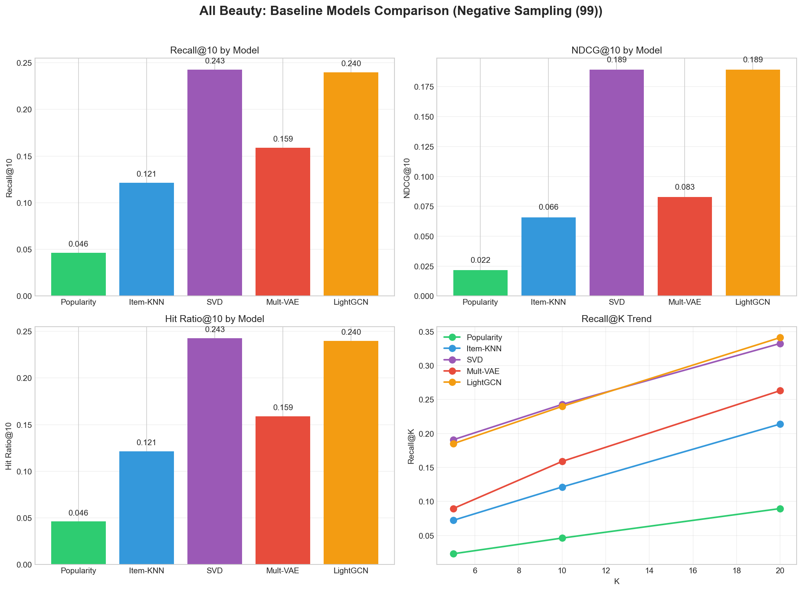
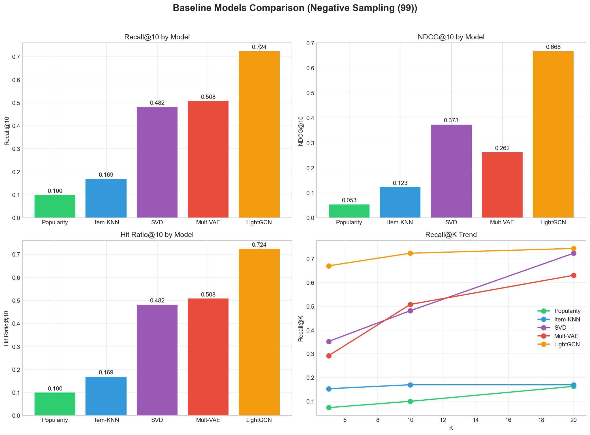
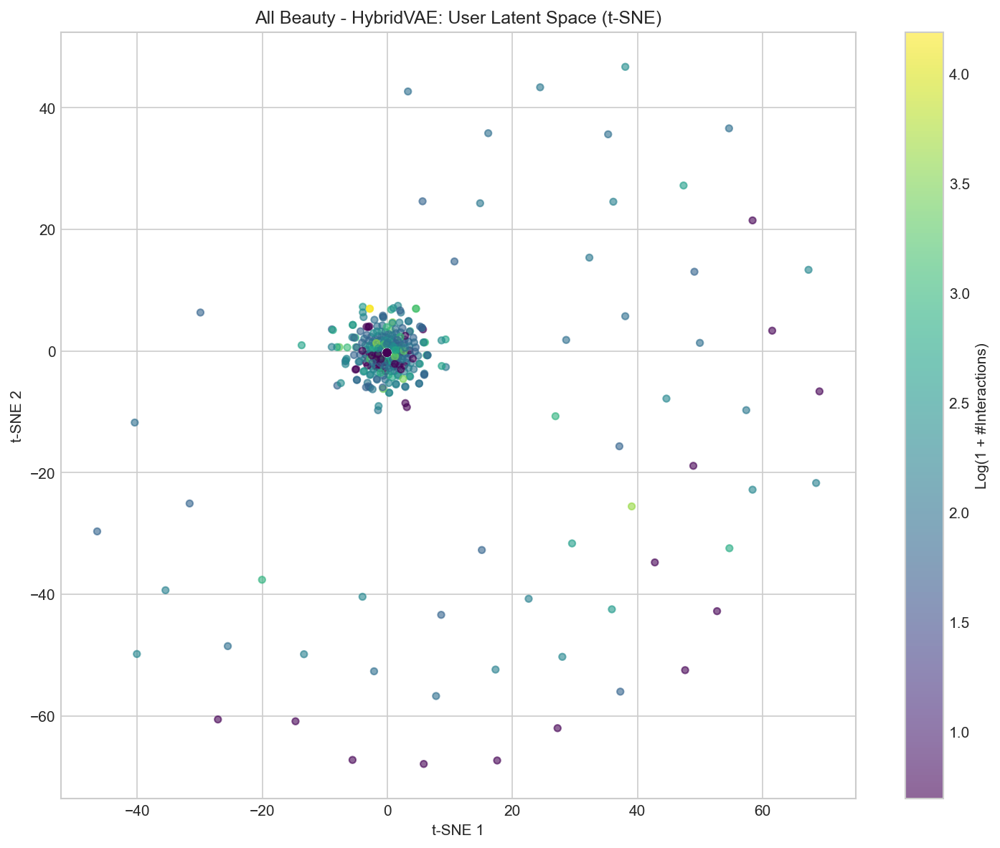
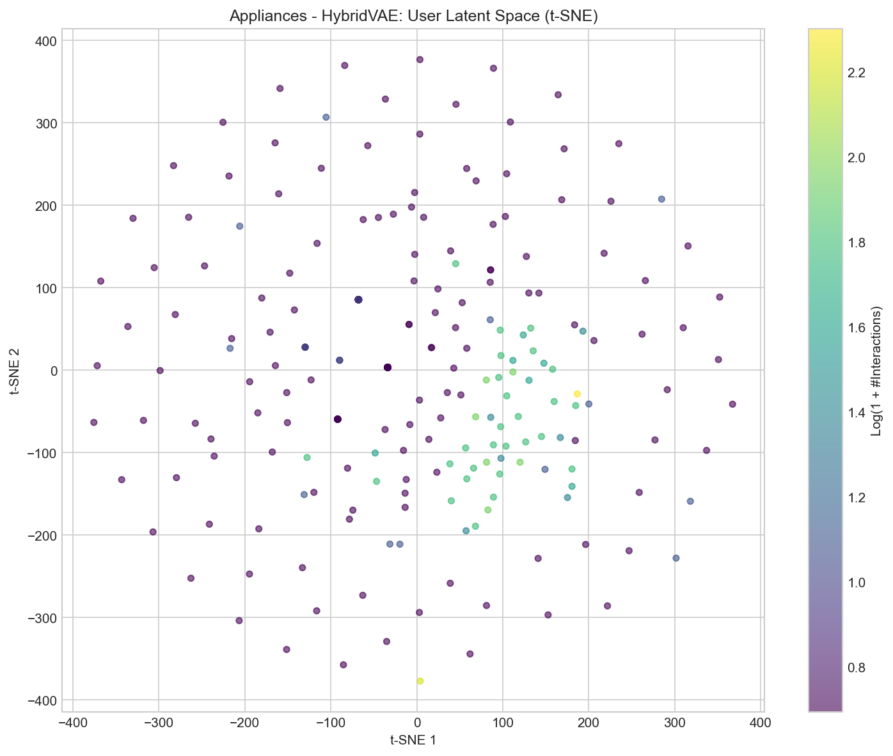
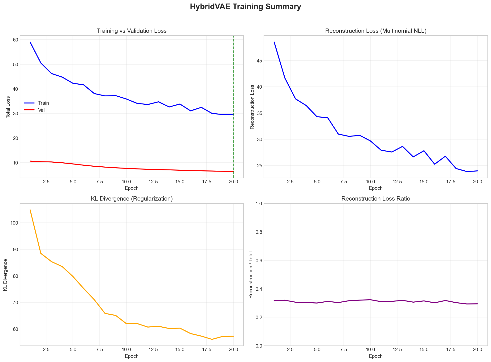
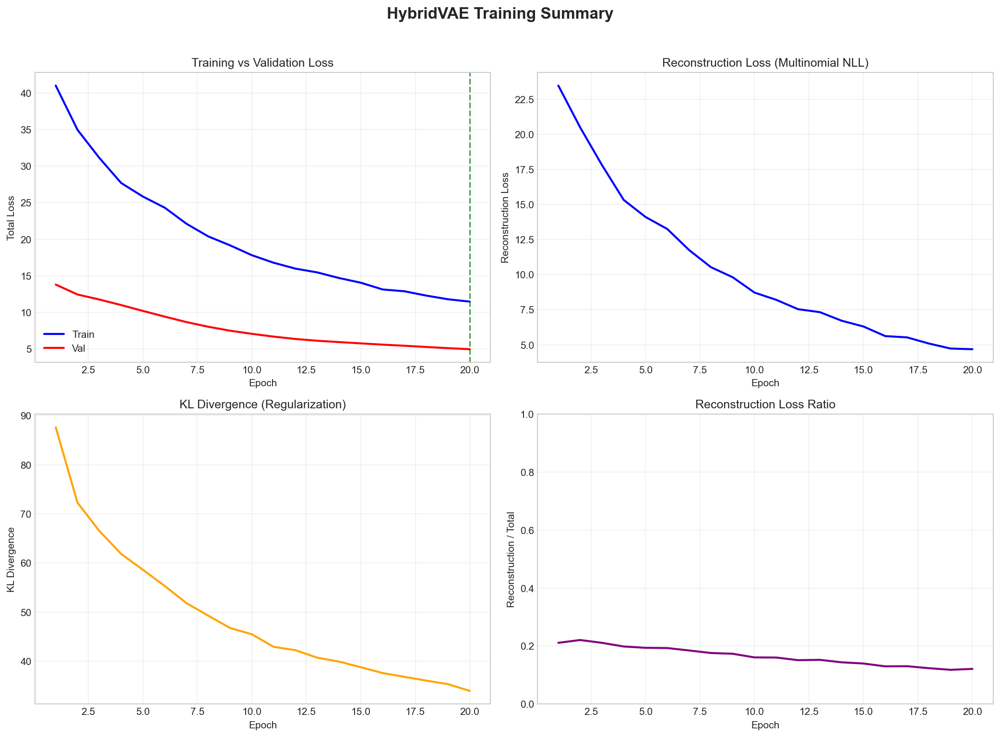
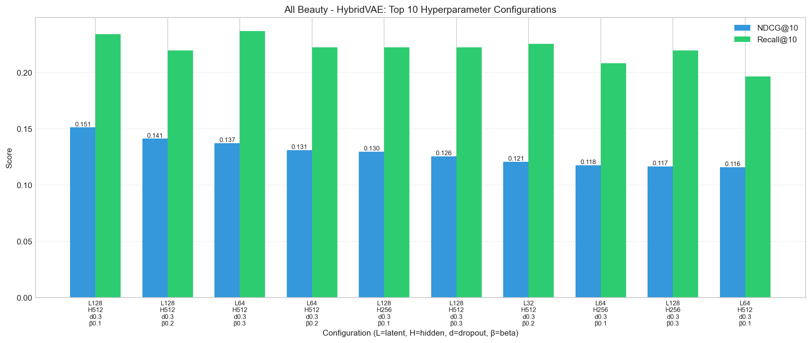

# HybridVAE Recommendation System

A hybrid recommendation model that combines collaborative filtering with semantic item representations derived from Sentence-BERT (SBERT). Using a **Variational Autoencoder (VAE)** with a **frozen embedding decoder**, the model effectively integrates text-based item semantics with user–item interaction patterns, providing strong performance on both sparse and dense datasets.

This repository includes a **fully automated pipeline** covering preprocessing, embedding generation, hyperparameter tuning, model training, evaluation, baselines, visualization, and API serving.

---

## Table of Contents

* [Results](#results)
* [Model Architecture](#model-architecture)
* [Autonomous Pipeline](#autonomous-pipeline)
* [Implementation Details](#implementation-details)
* [Installation](#installation)
* [Usage](#usage)
* [Project Structure](#project-structure)
* [Testing](#testing)
* [API](#api)
* [References](#references)
* [License](#license)

---

# Results

## Summary (NDCG@10)

| Model         | All_Beauty | Appliances |
| ------------- | :--------: | :--------: |
| **HybridVAE** |  **0.213** |    0.663   |
| LightGCN      |    0.189   |  **0.668** |
| SVD           |    0.189   |    0.373   |
| Mult-VAE      |    0.178   |    0.529   |
| Item-KNN      |    0.152   |    0.317   |
| Popularity    |    0.104   |    0.185   |

HybridVAE improves over LightGCN by **12.7%** on the sparse *All_Beauty* dataset, while achieving competitive performance on *Appliances*.

---

## Baseline Comparison

<p align="center">
  
  
</p>

---

## Detailed Metrics


<summary><b>All_Beauty (22,363 users, 12,101 items)</b></summary>
<br>

| Model         | Recall@5 | Recall@10 | Recall@20 | NDCG@5 | NDCG@10 | NDCG@20 |
| ------------- | :------: | :-------: | :-------: | :----: | :-----: | :-----: |
| **HybridVAE** |   0.195  |   0.286   |   0.403   |  0.181 |  0.213  |  0.247  |
| LightGCN      |   0.161  |   0.240   |   0.353   |  0.158 |  0.189  |  0.224  |
| SVD           |   0.160  |   0.243   |   0.365   |  0.156 |  0.189  |  0.227  |
| Mult-VAE      |   0.149  |   0.227   |   0.342   |  0.145 |  0.178  |  0.214  |
| Item-KNN      |   0.117  |   0.189   |   0.299   |  0.120 |  0.152  |  0.189  |
| Popularity    |   0.076  |   0.131   |   0.219   |  0.080 |  0.104  |  0.134  |
<br>

<summary><b>Appliances (2,072 users, 890 items)</b></summary>
<br>

| Model         | Recall@5 | Recall@10 | Recall@20 | NDCG@5 | NDCG@10 | NDCG@20 |
| ------------- | :------: | :-------: | :-------: | :----: | :-----: | :-----: |
| **HybridVAE** |   0.603  |   0.711   |   0.810   |  0.600 |  0.663  |  0.688  |
| LightGCN      |   0.617  |   0.724   |   0.820   |  0.605 |  0.668  |  0.694  |
| SVD           |   0.386  |   0.482   |   0.609   |  0.341 |  0.373  |  0.413  |
| Mult-VAE      |   0.471  |   0.583   |   0.704   |  0.478 |  0.529  |  0.563  |
| Item-KNN      |   0.265  |   0.367   |   0.502   |  0.267 |  0.317  |  0.362  |
| Popularity    |   0.149  |   0.224   |   0.342   |  0.147 |  0.185  |  0.226  |

---

# Model Architecture

HybridVAE integrates collaborative filtering with SBERT-derived semantic item representations.

## Encoder

```math
x \in \{0,1\}^{N_{\text{items}}}
```

```math
\mu = f_\mu(x), \quad \log \sigma^2 = f_\sigma(x)
```

Reparameterization:

```math
z = \mu + \sigma \odot \epsilon, \qquad \epsilon \sim \mathcal{N}(0, I)
```

## Decoder (Frozen SBERT Embeddings)

Let $E \in \mathbb{R}^{d \times N_{\text{items}}}$ be the fixed matrix of SBERT embeddings.

```math
\tilde{z} = W_{\text{proj}} z
```

```math
\text{scores} = E^\top \tilde{z}
```

## Loss Function

```math
L = L_{\text{recon}} + \beta \, D_{\mathrm{KL}} \big( q(z|x)\ \|\ p(z) \big)
```

where:

* $L_{\text{recon}}$ is the multinomial negative log-likelihood
* $β$ is annealed during training to prevent posterior collapse

---

## Visualizations (All_Beauty)

### Latent Space (t-SNE)

<p align="center">
  
  
</p>

### Training Curves

<p align="center">
  
  
</p>

### Hyperparameter Tuning (Grid Search)

<p align="center">
  
</p>

---

# Autonomous Pipeline

The Makefile orchestrates the entire experimental workflow.

| Step | Command           | Description                                                  |
| ---- | ----------------- | ------------------------------------------------------------ |
| 1    | `make preprocess` | Clean data, create temporal splits, compute SBERT embeddings |
| 2    | `make tune`       | Grid search over latent_dim, hidden_dims, dropout, β         |
| 3    | `make train-best` | Train using best configuration                               |
| 4    | `make evaluate`   | Compute Recall@K, NDCG@K, HR@K                               |
| 5    | `make baseline`   | Run Popularity, Item-KNN, SVD, Mult-VAE, LightGCN            |
| 6    | `make visualize`  | Generate all plots                                           |
| —    | `make all`        | Run the entire workflow end-to-end                           |

---

# Implementation Details

## Preprocessing

* Filter users/items with <5 interactions
* Convert ratings ≥4 into positive interactions
* Temporal train/val/test split (70/15/15)
* SBERT embeddings generated from item title + aggregated reviews

## Hyperparameter Search

| Parameter     | Values         | Best (All_Beauty) |
| ------------- | -------------- | ----------------- |
| latent_dim    | {64, 128}      | 128               |
| hidden_dims   | {[256], [512]} | [512]             |
| dropout       | {0.3, 0.5}     | 0.3               |
| beta          | {0.1, 0.2}     | 0.2               |
| learning_rate | {1e-3}         | 1e-3              |

Early stopping with patience=2.

## Evaluation

* Standard **99-negative sampling**
* Metrics: Recall@K, NDCG@K, Hit Rate@K

## Baselines

| Model      | Description                         |
| ---------- | ----------------------------------- |
| Popularity | Rank by interaction frequency       |
| Item-KNN   | Cosine similarity over item vectors |
| SVD        | Matrix factorization (Surprise)     |
| Mult-VAE   | Multinomial VAE                     |
| LightGCN   | Graph-based CF                      |

---

# Installation

```bash
git clone https://github.com/Aymane-Nouhail/Recommendation-System.git
cd Recommendation-System
python -m venv .venv
source .venv/bin/activate
pip install .
```

Dependencies include PyTorch, sentence-transformers, scikit-learn, scipy, and surprise.

---

# Usage

## Full Pipeline

```bash
make all
```

## Individual Steps

```bash
make preprocess
make tune
make train-best
make evaluate
make baseline
make visualize
```

---

# Project Structure

```
recommendation_system/
├── data/
├── embeddings/
├── models/
├── assets/
├── src/
│   ├── preprocessing/
│   ├── ml/
│   └── api/
├── tests/
├── Makefile
├── requirements.txt
└── README.md
```

---

# Testing

The project includes comprehensive test coverage:

```bash
# Run all tests
python -m pytest tests/ -v

# Run unit tests only (fast, mock data)
python -m pytest tests/test_unit.py -v

# Run end-to-end integration test (synthetic data, full pipeline)
python -m pytest tests/test_e2e_pipeline.py -v -s
```

| Test File | Description |
|-----------|-------------|
| `test_unit.py` | Unit tests for individual components (DatasetBuilder, HybridVAE, VAETrainer) |
| `test_e2e_pipeline.py` | Full pipeline integration test with synthetic data generation |

The e2e test validates the complete flow: raw data → cleaning → dataset splits → embeddings → training → evaluation → model save/load, all in memory without requiring external files.

---

# API

Start the server:

```bash
make run-api
# or
python -m src.api.server
```

### POST /recommend

**Request:**

```json
{
  "user_id": "user123",
  "top_k": 10
}
```

**Response:**

```json
{
  "user_id": "user123",
  "recommendations": [
    {"item_id": "B001234567", "score": 0.95}
  ]
}
```

---

# References

* Kingma & Welling (2014). Auto-Encoding Variational Bayes
* Liang et al. (2018). Variational Autoencoders for Collaborative Filtering
* He et al. (2020). LightGCN
* Reimers & Gurevych (2019). Sentence-BERT

---

# License

MIT License
